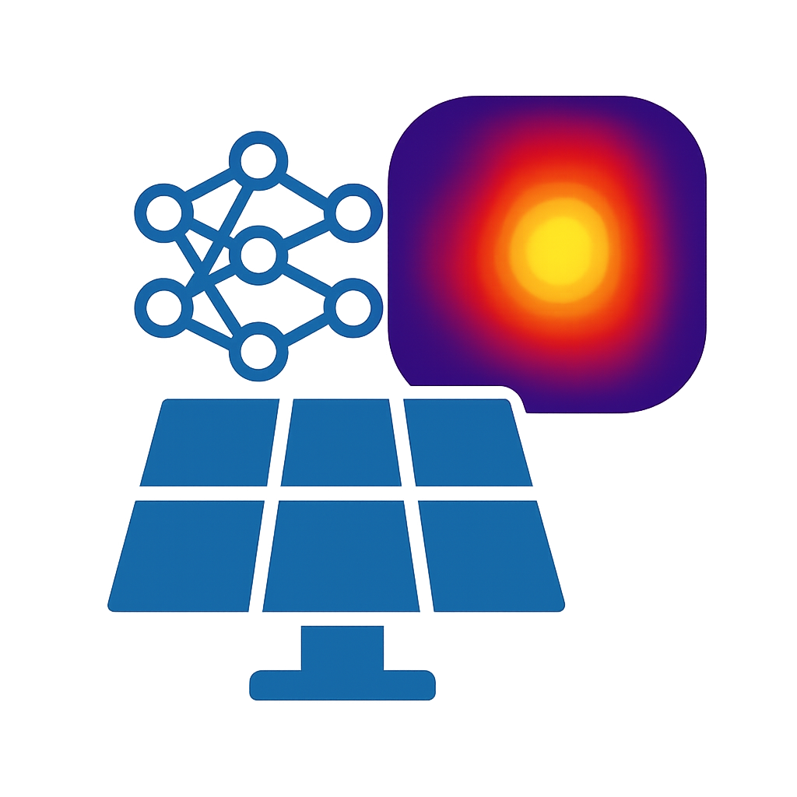

<div id="top"></div>

<br />
<div align="center">

  

  <h1 align="center">Redefining Failure Detection in PV Systems</h1>

  <h3 align="center">
    A Comparative Study of GPT-4o and ResNet’s Computer Vision in Aerial Infrared Imagery Analysis.
  </h3>
   <p align="center"> 
  Presented at <a href="https://www.eupvsec.org/">EUPVSEC 2024</a>  and article published in EPJ Journal!</p>

  ---
  <p align="center">
    <a href="https://doi.org/10.1051/epjpv/2025010"></a>
  </p>
</div>

<div align="center">
  <a href="https://orcid.org/0000-0002-6660-6115">Sandra Gallmetzer</a>
  •
  <a href="https://orcid.org/0009-0004-9898-1683">Mousa Sondoqah</a>
  •
  <a href="https://scholar.google.com/citations?user=JKw6RqwAAAAJ&hl=en">Evelyn Turri</a>
  •
  <a href="https://scholar.google.com/citations?user=yr_g9E0AAAAJ&hl=en">Lukas Koester</a>
  •
  <a href="https://scholar.google.com/citations?user=PEwMAC0AAAAJ&hl=en">Atse Louwen</a>
  •
  <a href="https://scholar.google.com/citations?user=xa1bwMUAAAAJ&hl=en">David Moser</a>
 <p align="center"> 
  </p>
</div>
<br />
<div align="center">
  <p align="center">
    <a href="https://www.eupvsec.org/" target="_blank"></a>
  </p>
</div>

<details open="open">
  <summary>Table of Contents</summary>
  <p>
    &emsp;🧠 <a href="#abstract-">Abstract</a><br>
    &emsp;❗ <a href="#requirements-️">Requirements</a><br>
    &emsp;🚀 <a href="#getting-started-">Getting Started</a><br>
    &emsp;🐝 <a href="#wandb-">WandB</a><br>
    &emsp;💻 <a href="#code-">Code</a><br>
    &emsp;📖 <a href="#citation-">Citation</a><br>
    &emsp;⭐️ <a href="#acknowledgement-️">Acknowledgement</a>
  </p>
</details>

## Abstract 🧠
The rapid growth of the solar photovoltaic industry underlines the importance of effective operation and maintenance strategies, particularly for large-scale systems. Aerial infrared thermography has become an essential tool for detecting anomalies in photovoltaic modules due to its cost-effectiveness and scalability. Continuous monitoring through advanced fault detection and classification methods can maintain optimal system performance and extend the life of PV modules. This study investigates the application of advanced artificial intelligence methods for fault detection and classification comparing the performance of GPT-4o, a multimodal large language model, and ResNet, a convolutional neural network renowned for image classification tasks.
Our research evaluates the effectiveness of both models using infrared images, focusing on binary defect detection and multiclass classification. ResNet demonstrated advantages in terms of computational efficiency and ease of implementation. Conversely, GPT-4o offered superior adaptability and interpretability,
effectively analysing multimodal data to identify and explain subtle anomalies in thermal imagery. However, its higher computational requirements limit its feasibility in resource-limited settings.
The results highlight the complementary strengths of these models and provide valuable insights into their role in advancing automated fault diagnosis in photovoltaic systems.

## Requirements ❗️
Follow the [installation.md](installation.md) to download the repository and install all the packages for running the code.


## Getting started 🚀

### Dataset
The dataset used is the [Infrared Solar Modules](https://github.com/RaptorMaps/InfraredSolarModules) proposed by [RaptorMaps](https://raptormaps.com/) at ICLR2020.   

You can download the dataset from the dataset [github](https://github.com/RaptorMaps/InfraredSolarModules) or otherwise just copy these commands in the command line of the project folder. 

```bash
cd dataset
git clone https://github.com/RaptorMaps/InfraredSolarModules.git
unzip InfraredSolarModules/2020-02-14_InfraredSolarModules.zip
cd ..
```
> [!IMPORTANT]
> Pay attention to download the dataset in the dataset folder as with the above commands. If you have the dataset in another folder you must change the path in the config file, as explained in the next session. 

### Color Datasets
To perform our tests we decided to try also with color images. To obtain them we convert greyscale images into color images by using two different color maps. 

- **Color Map 1** : map to color the range of grey scale between [black, white] into [blue, red] scale by using a linear interpolation of the colors. 
- **Color Map 2** : map based on the [JetColorMap](https://it.mathworks.com/help/matlab/ref/jet.html), in order to enhance different shades of gray. (To have further details read the paper Section )

To obtain the 2 new datasets, the code in file [color_dataset.py](dataset/color_dataset.py), and you can run it by running in the terminal:
```bash
python dataset/color_dataset.py
```
### Config
Change config variables in [config](config/config.yaml) file in order to have all the desired settings. 


## WandB 🐝
We also set up [WandB](https://wandb.ai/site) configuration in the code, to trace all the experiments for the ResNet part. 

If you want to run your own experiments on your account, you just need to modify the [config](config/config.yaml) file and follow these steps:

1) Make a WandB account if you do not have one

2) Copy your API Key from you account and add it to the file under the variable `api_key`

4) Enable or disable wandb runs, based if you want to trace your runs or not, by changing `wandb` tag in `True` or `False`

5) Edit the config file based on what you want to run

## Code 💻
The code is divided into 2 parts, one for the resNet part and the other one for GPT-4o.

### ResNet
If you want to run the code for the ResNet part, you just need to run on the bash the following command:

```bash
python run/main.py
```
**Configurations** Before running the command, make sure to change all the settings in the [config](config/config.yaml) file based on what you want to run. Some of them are the following:
- `task`: the task you want to solve. Choose between: `binary-classification`, `multi-classification`, `multi-classification-reduction`, `multi-classification-reduction1`.
- `color`: can be set to `True`, `False`, based if you want to run with the color dataset or not.
- `resnet`: choose which type of ResNet model use. Choose between ResNet18, ResNet50 or ResNet101. 
- `checkpoint`: path to the checkpoint to use for the validation part. If you want to validate a model, add the path to the checkpoint here. (Pay attention that the checkpoint has to be coeherent with the resnet used!)

> [!TIP]
> Checkpoints for the pre-trained ResNets are available in the Realease section. Once download the desired checkpoints, create a folder named `checkpoints` and move them there. 

### GPT-4o
If you want to run the code for the ResNet part, you just need to run on the bash the following command:

```bash
python run/run_gpt4o.py
```

Or customize the run with various options:
```bash
python run/run_gpt4o.py --mode binary --max-images 20 --images path/to/images
```
**Configurations** Some configurations flag you can use are the following:
- `--seed`: Random seed for reproducibility (default: 5678)
- `--images`: Path to image folder
- `--metadata`: Path to metadata JSON file
- `--max-images`: Maximum number of test images to process
- `--mode`: Classification mode to run (binary, detailed, reduced, or all)
- `--binary-dataset`: Path to binary classification dataset YAML
- `--multi-dataset`: Path to multi-class classification dataset YAML
- `--reduced-dataset`: Path to reduced classification dataset YAML

## Citation 📖
```latex
@article{ refId0,
	author = {{Gallmetzer, Sandra} and {Sondoqah, Mousa} and {Turri, Evelyn} and {Koester, Lukas} and {Louwen, Atse} and {Moser, David}},
	title = {Redefining failure detection in PV Systems: a comparative study of GPT-4o and ResNet's computer vision in aerial infrared imagery analysis},
	DOI= {10.1051/epjpv/2025010},
	url= {https://doi.org/10.1051/epjpv/2025010},
	journal = {EPJ Photovolt.},
	year = 2025,
	volume = 16,
	pages = {23},
}
```
## Acknowledgement ⭐️
This publication is co-funded by the European Union from the European Union’s Horizon Europe Research and Innovation Programme under Grant Agreement No 101146883, project "Supernova".
Views and opinions expressed are however those of the author(s) only and do not necessarily reflect those of the European Union or CINEA. Neither the European Union nor the granting authority can be held responsible for them.

Further, the authors acknowledge the financial support from the project
PE00000021 "Network 4 Energy Sustainable Transition - NEST PNRR MUR".

> [!NOTE] 
> The project has been done when all the authors were working in [Eurac Research](https://www.eurac.edu/en). 


